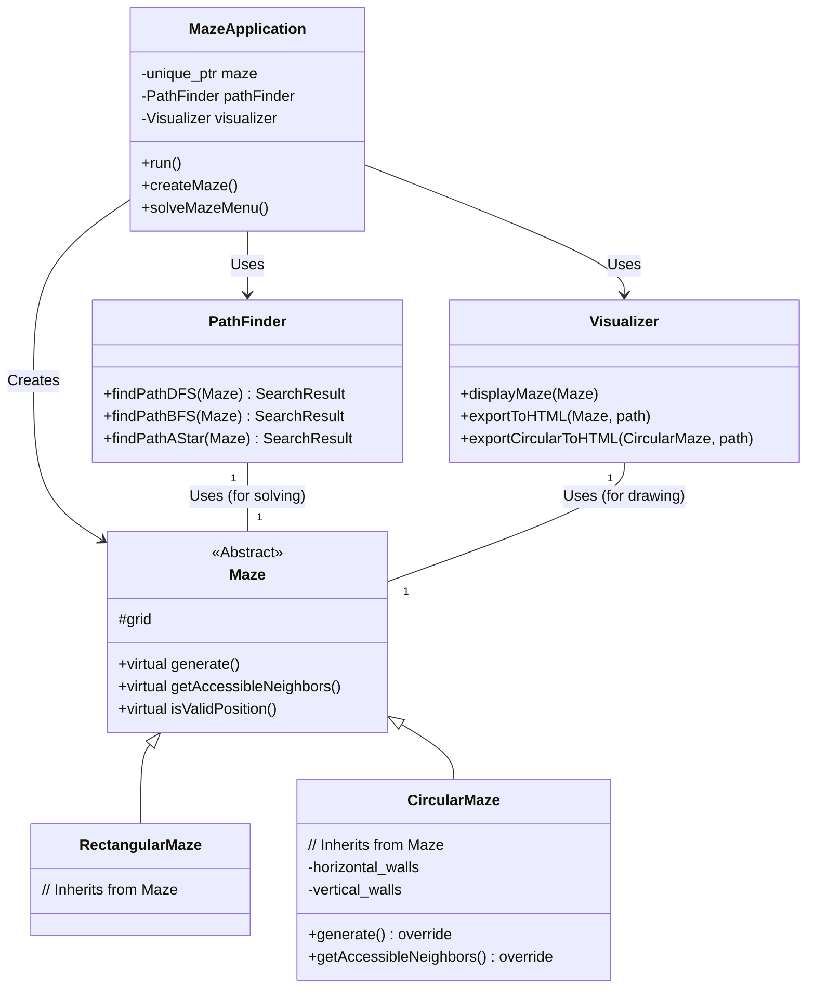

# C++ Maze Pathfinder / C++ 迷宫寻路系统

A fully-functional C++ maze pathfinding system that implements multiple search algorithms and provides a graphical visualization interface, with support for both rectangular and circular mazes.

一个功能完整的C++迷宫寻路系统，实现了多种路径寻找算法并提供图形化可视化界面，支持矩形和圆形两种迷宫。

---

## 🎯 Project Features / 项目特性

- **Multiple Maze Types / 多种迷宫类型**:
  - **Rectangular Maze**: Standard grid-based maze. / **矩形迷宫**：标准的网格迷宫。
  - **Circular Maze**: (Advanced Feature) Generates and solves complex circular (theta) mazes. / **圆形迷宫**（进阶功能）：生成并求解复杂的圆形迷宫。

- **Maze Generation / 迷宫生成**:
  - **DFS Algorithm**: Generates perfect mazes (guaranteed to be solvable). / **DFS算法**：生成保证连通的完美迷宫。
  - **Randomized Walls**: Generates mazes by randomly removing walls. / **随机墙壁**：通过随机移除墙壁生成迷宫。

- **Pathfinding Algorithms / 路径寻找算法**:
  - **DFS**: Depth-First Search. / **深度优先搜索**。
  - **BFS**: Breadth-First Search (guarantees the shortest path in steps). / **广度优先搜索**（保证步数最短）。
  - **A***: A* Search with Manhattan distance heuristic. / **A\*算法**：使用曼哈顿距离作为启发函数。

- **Visualization / 可视化展示**:
  - **Console Output**: Displays the maze directly in the console with ASCII characters. / **控制台输出**：使用ASCII字符在控制台直接显示迷宫。
  - **HTML Export**: Exports the maze and the solution path to a visual HTML file (supports both rectangular and circular mazes). / **HTML导出**：将迷宫和路径导出为可视化的HTML文件（同时支持矩形和圆形迷宫）。

- **Analysis / 性能分析**:
  - Provides performance comparison of different algorithms, including execution time, nodes visited, and path length. / 提供不同算法的性能对比，包括执行时间、访问节点数和路径长度。

---

## 🏗️ Project Framework / 项目框架

The project is designed with a modular and extensible structure. The core components are decoupled, making it easy to add new maze types or algorithms.

项目采用模块化和可扩展的设计。核心组件之间解耦，可以轻松添加新的迷宫类型或寻路算法。

### Class Structure and Call Flow / 类结构与调用流程



- **`main.cpp` (`MazeApplication`)**: The main entry point. It handles user interaction and orchestrates the creation, solving, and visualization of mazes.
- **`Maze` (Base Class)**: An abstract base class defining the common interface for all maze types. It uses virtual functions like `generate()` and `getAccessibleNeighbors()` to allow for polymorphism.
- **`RectangularMaze` / `CircularMaze`**: Concrete implementations of the `Maze` class, each with its own data structure and generation logic.
- **`PathFinder`**: Contains the pathfinding algorithms (DFS, BFS, A*). It operates on a `Maze` object, making it independent of the specific maze type.
- **`Visualizer`**: Responsible for rendering the maze, both in the console and as an HTML file. It uses `dynamic_cast` to handle different maze types for visualization.

---

## 📁 Project Structure / 项目文件结构

```
UCAS-DSA-Project/
├── maze.h              # Base class for mazes / 迷宫基类
├── maze.cpp            # Implementation for RectangularMaze / 矩形迷宫实现
├── CircularMaze.h      # Class definition for circular mazes / 圆形迷宫类定义
├── CircularMaze.cpp    # Implementation for circular mazes / 圆形迷宫实现
├── pathfinder.h        # Pathfinding algorithms definition / 寻路算法定义
├── pathfinder.cpp      # Pathfinding algorithms implementation / 寻路算法实现
├── visualizer.h        # Visualizer definition / 可视化器定义
├── visualizer.cpp      # Visualizer implementation / 可视化器实现
├── main.cpp            # Main program file / 主程序文件
├── Makefile            # Build configuration / 编译配置文件
└── README.md           # This file / 本文档
```

---

## 🛠️ Build and Run / 编译和运行

### Requirements / 系统要求
- C++17 compiler (g++)
- Make tool
- Linux/macOS/Windows (Linux recommended)

### Build Instructions / 编译指令

```bash
# Clean previous builds (optional)
make clean

# Compile the program
make

# Run the program
./maze_solver
```

---

## 🎮 How to Use / 使用说明

1.  **Create a Maze / 创建迷宫**:
    - Choose `1` in the main menu.
    - Select `1` for a rectangular maze or `2` for a circular maze.
    - Follow the prompts to specify dimensions.

2.  **Solve the Maze / 求解迷宫**:
    - Choose `2` in the main menu.
    - Select a pathfinding algorithm (DFS, BFS, or A*).

3.  **Export Results / 导出结果**:
    - Choose `5` in the main menu.
    - Select `2` to generate an HTML file.
    - Enter a filename. The program will generate an HTML file (e.g., `my_maze.html`) in the project directory.

---

## 🧪 Testing Guide / 测试指南

### Quick Test / 快速测试

```bash
# Compile the program / 编译程序
make

# Run the program / 运行程序
./maze_solver
```

### Test Cases / 测试用例

#### Test Case 1: Create a Simple Rectangular Maze / 测试用例1：创建简单矩形迷宫
1. Start the program / 启动程序
2. Choose "1. Create Maze" / 选择 "1. 创建迷宫"
3. Choose "1. Create Rectangular Maze" / 选择 "1. 创建矩形迷宫"
4. Enter maze dimensions: 8 12 / 输入迷宫尺寸：8 12
5. Choose generation method: 1 (Random) or 2 (DFS) / 选择生成方式：1 (随机) 或 2 (DFS)
6. If choosing random, enter wall removal probability: 0.3 / 如果选择随机，输入墙壁移除概率：0.3

#### Test Case 2: Create a Circular Maze / 测试用例2：创建圆形迷宫
1. Start the program / 启动程序
2. Choose "1. Create Maze" / 选择 "1. 创建迷宫"
3. Choose "2. Create Circular Maze" / 选择 "2. 创建圆形迷宫"
4. Enter number of rings: 5 / 输入环数：5

#### Test Case 3: Solve Maze with BFS / 测试用例3：使用BFS求解迷宫
1. Choose "2. Solve Maze" / 选择 "2. 求解迷宫"
2. Choose "2. Breadth-First Search (BFS)" / 选择 "2. 广度优先搜索 (BFS)"
3. Choose to display path visualization: y / 选择显示路径可视化：y

#### Test Case 4: Compare All Algorithms / 测试用例4：比较所有算法
1. Choose "3. Algorithm Performance Comparison" / 选择 "3. 算法性能比较"
2. Observe the performance differences between algorithms / 观察不同算法的性能差异

#### Test Case 5: Export HTML Visualization / 测试用例5：导出HTML可视化
1. Choose "5. Export Results" / 选择 "5. 导出结果"
2. Choose "2. Generate HTML Visualization File" / 选择 "2. 生成HTML可视化文件"
3. Enter filename: test_maze / 输入文件名：test_maze
4. Open test_maze.html in your browser / 在浏览器中打开 test_maze.html

### Expected Results / 预期结果

The program should be able to: / 程序应该能够：
- Successfully generate mazes / 成功生成迷宫
- Find paths from start to end / 找到从起点到终点的路径
- Display algorithm performance comparison / 显示算法性能比较
- Generate HTML visualization files / 生成HTML可视化文件

### Performance Benchmarks / 性能基准

On standard hardware (Intel i5, 8GB RAM): / 在标准硬件上（Intel i5，8GB RAM）：
- 10×10 maze: < 1ms / 10×10迷宫：< 1ms
- 50×50 maze: < 100ms / 50×50迷宫：< 100ms
- 100×100 maze: < 1s / 100×100迷宫：< 1s

### Known Issues / 已知问题

- Some terminals may not support color display / 某些终端可能不支持颜色显示
- Animation features need further improvement / 动画功能需要进一步完善
- Large mazes may require longer computation time / 大型迷宫可能需要更长的计算时间

---

## 📄 License / 许可证

This project is licensed under the MIT License. See the [LICENSE](LICENSE) file for details.

本项目采用MIT许可证授权。详见[LICENSE](LICENSE)文件。
