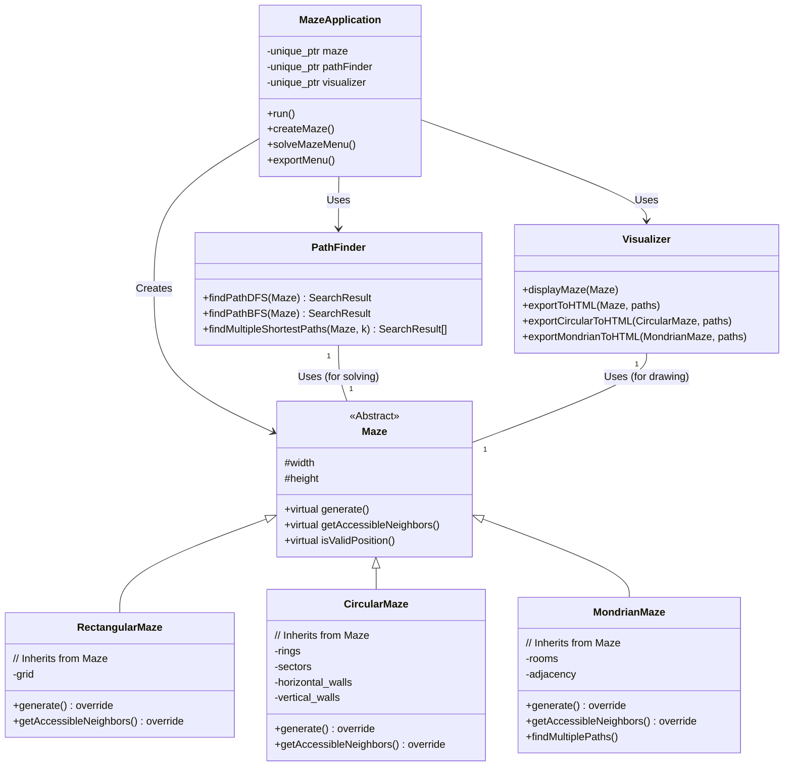

# 迷宫寻路

## 项目特性

- **多种迷宫类型**：当前项目支持经典矩形格点迷宫、Mondrian风格迷宫两种生成方式，圆形迷宫生成方式正在开发中。
- **多算法寻路**：内置广度优先搜索（BFS）、深度优先搜索（DFS）等多种路径搜索算法，保证最短路径可查找。
- **多路径支持**：可查找并导出蒙德里安迷宫的前6条最短路径，适合算法教学与可视化演示。
- **终端与HTML可视化**：支持终端ASCII可视化和美观的HTML导出。
- **结构清晰，易于扩展**：采用模块化设计，便于添加新迷宫类型或算法。

---

## 项目文件结构

```
UCAS-DSA-Project/
├── src/                    # 源代码目录
│   ├── main.cpp
│   ├── maze.cpp
│   ├── CircularMaze.cpp
│   ├── mondrian_maze.cpp
│   ├── pathfinder.cpp
│   └── visualizer.cpp
├── include/                # 头文件目录
│   ├── maze.h
│   ├── CircularMaze.h
│   ├── mondrian_maze.h
│   ├── pathfinder.h
│   └── visualizer.h
├── Makefile                # 构建脚本
├── LICENSE                 
├── .gitignore              
└── README.md               
```

---

## 项目框架




---


## 使用说明

### 依赖环境

- 支持 C++11 及以上标准的编译器（如 g++）
- 推荐 Linux/macOS/WSL 环境，Windows 亦可

### 编译方法

```bash
make
```
或手动编译：
```bash
g++ -std=c++11 -Iinclude src/*.cpp -o maze_solver
```

### 运行方法

```bash
./maze_solver
```
根据终端提示选择迷宫类型、生成方式、算法、导出等操作。

### 主要功能菜单

1. 生成迷宫（支持矩形、蒙德里安风格）
2. 选择路径搜索算法（BFS、DFS、A*等）
3. 查找并显示路径（支持多路径同时显示）
4. 导出HTML可视化文件（自动居中，多路径高亮）

---

## 测试用例

### 1. 生成并求解经典格点迷宫

- 选择“生成迷宫”，输入尺寸如 10×10
- 选择“DFS”或“随机”生成方式
- 选择“BFS”算法求解
- 可导出HTML文件查看路径

### 2. 生成并求解蒙德里安迷宫（多路径）

- 选择“生成迷宫”->“蒙德里安风格”
- 自动生成色块分割迷宫
- 选择“多路径导出”，可导出前6条最短路径的HTML文件
- 打开HTML文件，查看所有路径高亮效果


---


